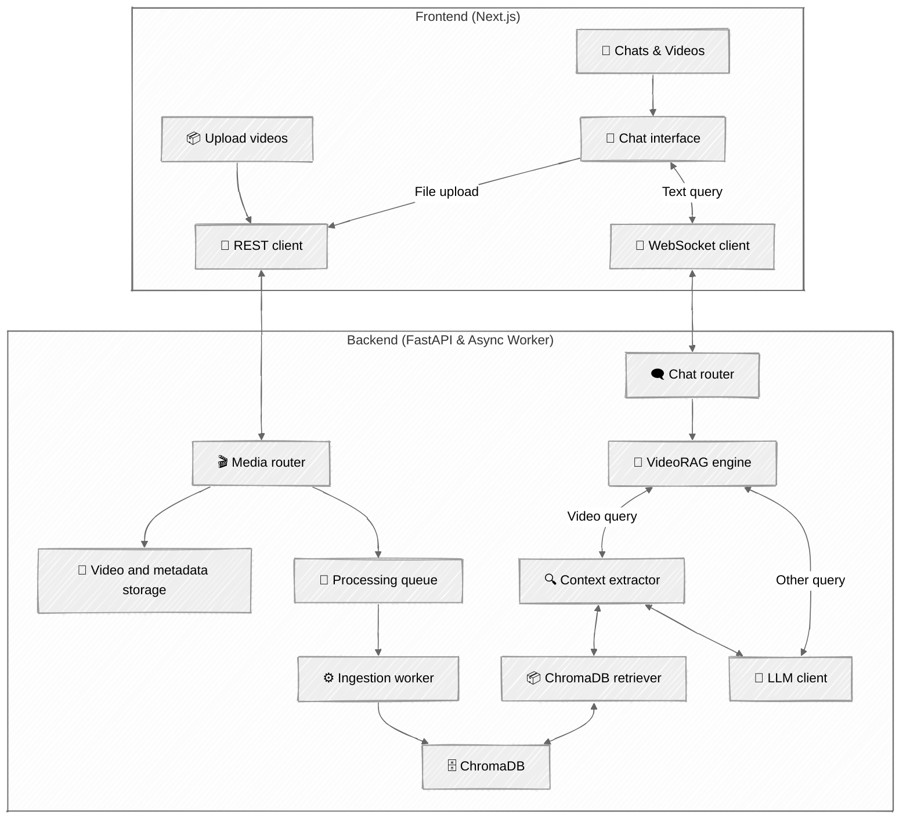

# ChronoChat

**ChronoChat** is a UI for **Ollama** that enables users to chat with video content using non vision/video-language models (VLMs). It supports both YouTube and local uploads and uses retrieval-augmented generation (RAG) to answer questions using video transcripts, frames, and captions. Powered by local LLMs, ChronoChat streams real-time responses with additional support for images and PDF uploads.


https://github.com/user-attachments/assets/983ef2d6-f9cb-410c-8d3a-13bcc2a35c0e


> [!NOTE]
> **ChronoChat is ideal for:** </br>
> - ✅ Interviews, tutorials, and educational content </br>
> - ❌ Not suited for animations or silent videos </br>
>
> **⚠️ Requires a GPU for optimal performance**

## 🏁 Getting Started

### 1. 📦 Set Up Python Environment

```bash
# Create and activate a virtual environment
python -m venv .venv
source .venv/bin/activate  # On Windows: .venv\Scripts\activate
```

### 2. 🔨 Install Dependencies for ChronoChat

```bash
python cli.py install
```

### 3. ⚙️ Install PyTorch with CUDA (Recommended)

For GPU acceleration, install the CUDA-enabled version of PyTorch: <br />
Visit https://pytorch.org/get-started/locally/ to get the correct command for your system.

> 💡 If you don’t have an NVIDIA GPU or don’t want CUDA, skip this step

### 4. 🎞️ Install FFmpeg

ChronoChat requires `ffmpeg` for processing video and audio. <br />
Download from: [https://ffmpeg.org/download.html](https://ffmpeg.org/download.html)

### 5. 🤖 Install Ollama

If you haven’t already, install [Ollama](https://ollama.com)

### 6. 🖥️ Start the Ollama Server

```bash
ollama serve
```

### 7. 🚀 Launch ChronoChat

```bash
python cli.py start
```

Then open your browser at: [http://localhost:3000](http://localhost:3000)

## ✨ Key Features

* 🔍 **Video RAG**: Uses CLIP, Whisper, and BLIP embeddings for frame, audio, and caption-based retrieval.
* 🧠 **LLM Planning**: Models generate reasoning chains, plan actions, and adapt to single or multi-video chats.
* 🔌 **Streaming Responses**: Live WebSocket chat with markdown rendering and response progress updates.
* 🎥 **Multi-Video Support**: Search and reason across multiple videos in a single conversation.
* 📎 **Attach Files**: Supports uploading PDFs and images.

## 🧱 Architecture



## ⚙️ Tech Stack

| Layer      | Tools                                 |
| ---------- | ------------------------------------- |
| Frontend   | Next.js, TailwindCSS, Shadcn, TypeScript |
| Backend    | FastAPI, AsyncIO, SQLite, ChromaDB     |
| Embeddings | CLIP (frames), Whisper (audio), BLIP  |
| LLM        | Ollama       |
| Storage    | Local files, ChromaDB vectors, SQLite |

## 🧠 How It Works

1. **Ingest Video**: Extracts audio, frames, and captions from YouTube/local videos.
2. **Embed Content**: Computes multimodal embeddings and stores them in ChromaDB.
3. **Chat Interaction**: LLM receives the user query and selects a retrieval mode.
4. **RAG Flow**: Relevant chunks are retrieved based on video context.
5. **Response Streaming**: Final output is streamed to the user in real time.
