# ChronoChat

**ChronoChat** is a conversational AI platform that enables users to chat with video content. It supports both YouTube and local uploads and uses retrieval-augmented generation (RAG) to answer questions using video transcripts, frames, and captions. Powered by local LLMs (via **Ollama**), ChronoChat streams real-time responses with full multimodal awareness, and additional support for images and PDF uploads.

> [!NOTE]
> **ChronoChat is ideal for:** </br>
> - ✅ Interviews, tutorials, and educational content </br>
> - ❌ Not suited for animations or silent videos </br>

## ✨ Key Features

* 🔍 **Video RAG**: Uses CLIP, Whisper, and BLIP embeddings for frame, audio, and caption-based retrieval.
* 🧠 **LLM Planning**: Models generate reasoning chains, plan actions, and adapt to single or multi-video chats.
* 🔌 **Streaming Responses**: Live WebSocket chat with markdown rendering and response progress updates.
* 🎥 **Multi-Video Support**: Search and reason across multiple videos in a single conversation.
* 📎 **Attach Files**: Supports uploading PDFs and documents for context-aware responses (extensible).

## 🏁 Getting Started

```bash
python cli.py start
```

Then go to: [http://localhost:3000](http://localhost:3000)

## 🧱 Architecture

```mermaid
---
config:
  look: handDrawn
  theme: neutral
---

graph TD
  subgraph "Frontend (Next.js)"
    Sidebar["📂 Chats & Videos"]
    UploadUI["📦 Upload videos"]
    ChatUI["💬 Chat interface"]
    APIClient["🔗 REST client"]
    WSClient["🔄 WebSocket client"]
  end

  subgraph "Backend (FastAPI & Worker)"
    API["🧭 FastAPI server"]
    ChatRouter["🗨️ Chat router"]
    MediaRouter["🎬 Media router"]
    VideoRAG["🧠 VideoRAG engine"]
    ContextExtractor["🔍 Context extractor"]
    Retriever["📦 ChromaDB retriever"]
    LLMClient["🤖 LLM client"]
    Worker["⚙️ Ingestion worker"]
    MediaDB["🗄️ Vector DB"]
    MediaStorage["📁 Video and metadata storage"]
    VideoQueue["📮 Processing queue"]
  end

  Sidebar --> ChatUI
  UploadUI --> APIClient
  ChatUI --> APIClient
  ChatUI --> WSClient

  APIClient <--> API
  WSClient --> ChatRouter
  ChatRouter --> VideoRAG
  VideoRAG --> ContextExtractor
  ContextExtractor --> Retriever
  Retriever --> MediaDB
  VideoRAG --> LLMClient

  ChatRouter --> WSClient
  WSClient --> ChatUI

  API --> MediaRouter
  MediaRouter --> MediaDB
  MediaRouter --> MediaStorage
  MediaRouter --> VideoQueue
  VideoQueue --> Worker
  Worker --> ContextExtractor
  Worker --> Retriever
  Worker --> MediaDB
  Worker --> MediaStorage
```



## ⚙️ Tech Stack

| Layer      | Tools                                 |
| ---------- | ------------------------------------- |
| Frontend   | Next.js, TailwindCSS, TypeScript      |
| Backend    | FastAPI, Celery, SQLite, ChromaDB     |
| Embeddings | CLIP (frames), Whisper (audio), BLIP  |
| LLM        | Ollama (default: `qwen:0.6b`)         |
| Storage    | Local files, ChromaDB vectors, SQLite |

## 🧠 How It Works

1. **Ingest Video**: Extracts audio, frames, and captions from YouTube/local videos.
2. **Embed Content**: Computes multimodal embeddings and stores them in ChromaDB.
3. **Chat Interaction**: LLM receives the user query and plans an action.
4. **RAG Flow**: Relevant chunks are retrieved based on video context.
5. **Response Streaming**: Final output is streamed to the user in real time.
